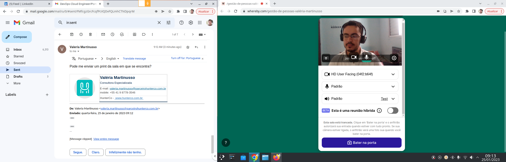

## Container Monitoring

# Descrição do Projeto

Dahsboard para monitorar containers e servidores Linux

Nesse projeto temos quatro containers: 
Node Expoter -> Coleta dados do seu servidor Linux
Cadvisor -> Criado pelo google, coleta dados dos seus containers
Prometheus -> Coleta metricas através do protocolo HTTP 
Grafana -> Ferramenta apra exibir metricas através de uma interface mais interativa

Para rodar esse projeto basta usar esse comando no terminal:
"docker-compose up -d --build"

